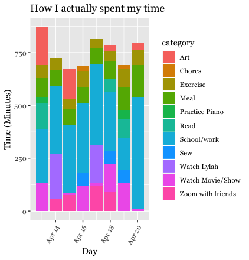

```{r setup, include=FALSE}
knitr::opts_chunk$set(echo = TRUE)
```


```{r, eval=FALSE, include=FALSE}

```

# Diary of a Data Science Student
## How to Avoid Cabin Fever in the Age of COVID-19


### Motivation + Primary Questions of Interest

It is difficult to reflect upon the age of COVID-19, as we have not yet left it.  Regardless, this time will surely be known as a global turning point.  As a college student, my semester was abruptly disrupted when I was told to leave campus and finish the semester remotely from home.  Since I attend Amherst College, a small liberal arts institution that emphasizes the importance of small, in-person classes for fostering an intimate, intellectual environment, this was a difficult transition for various reasons.
I function in my school environment and home environment very differently, so I knew that I would have to make some changes to my home environment in order to retain my motivation and focus for my schoolwork.  I decided that creating a strong sense of structure would be most effective for my learning, since my days on campus were very structured.  In order to maintain this structure, I decided that I would create a schedule every morning when I wake up, and try my best to stick to it.  I was also curious about how well I would stick to this "intended schedule", so I created an "actual schedule", as well, in which I logged all of my actual activity after it had been completed.  I did this for one week.  Afterwards, I studied how I intended to spend my time and how I actually spent my time.


# Data collection

I collected data by . . . 

1. Creating two separate Google calendars, one titled "Intended Schedule", and one titled "Actual Schedule".
2. Logging the activity for my "intended schedule" for each day every morning when I woke up.
3. Logging the activity for my "actual schedule" every time I finished completing an activity.

I wrangled the data by . . .

1. Importing the calendars as data frames from Google calendar into R Studio
2. Creating variables for length of time spent on activities, category of activity, etc.
3. Assigning specific activities to broader categories for classification.


# Results

And here are my results . . .

## Initial round of visualizations 
### How much time did I intend to spend each day on each activity?
### How much time did I actually spend each day on each activity?

During my initial round of visualizations, I was mainly concerned with the breakdown of time spent on each of the categories for every day of the week.

I first created bar charts for each data set with date on the x-axis, and total time in minutes on the y-axis.  I set fill to equal the category variable so that the colors of the bars would correspond to the amount of time spend on each kind of activity.  




I then did the same thing with the addition of the coord_polar() function, to turn the bar charts into circles.  


The third group of visualizations at this step also consisted of bar charts, but they were now faceted by category, rather than "filling" by category.  This allows you to see the time spent on individual categories alone.


## Second Round of Visualizations

For the next set of visualizations, I decided to calculate and graph proportions.  I wanted to see the proportion of time spent on certain activities out of the total time in a week (for both the intended schedule and the actual schedule).  I calculated these proportions and placed them into new data sets.  I then combined the intended and actual data sets by using the bind_rows() function.  This is how I generated visuals comparing the proportions for the intended schedule vs. the actual schedule.  I first generated two different data tables and corresponding bar charts to show the proportions within each category (for intended vs. actual).  I was mostly interested in the proportion of time spent on school/work and exercise, so these are the categories I decided to focus on.  For these bar plots, the x-axis is the type of schedule and the y-axis is the proportion of time spent on the designated category of activity.  I chose to group the bars instead of stacking them because I felt that this was easier to view.


# Summary 

For this project, I was most interested in studying how I intend to spend my time during quarantine compared to how I actually spend my time during quarantine.  To collect this data, I first created two separate calendars using Google Calendar.  I logged my activity for one week.  Every morning during this week, I would create my intended schedule for the day.  Then, whenever I actually completed an activity, I would log this activity onto the "actual schedule".  The title of each activity was eventually listed under the "summary" variable in the data set.  When the week was over, I imported the two calendar data sets into Studio by using the ical package.  After importing the data sets, I began to wrangle them.
Because I was interested in studying how I spend my time across many categories, this was the most important step of the wrangling.  I placed the observations into enough categories so that the categories were specific (and distinguishable from each other), but also so that there were not too many.  The case_when() function and str_detect() functions were the most helpful during this process.  I used to str_detect() function to identify keywords in the "summary" variable, like "HW", and the case_when() function was used to place the observations with these criteria into a category, like "School/work".  The category "School/Work" encompasses activities like classes, homework, and work for on-campus jobs that I still hold.  Once the data was wrangled, I began to generate proportions and visualizations.  Since my main question is generally "How do I actually spend my time compared to how I intend to spend my time?", I first created a simple bar chart with date on the x-axis, time (in minutes) on the y-axis, and fill by category, for the intended data set and the actual data set separately. I then compared them side by side.  I saw the breakdown of my time spent for each day of the week across all of the categories (told apart by color).  I then decided to turn these two bar charts into circles using the coord_polar() function.  Just by studying these charts, it appeared that I spent more time creating art than I intended to, and that I spent less time doing school/work than I intended to.  Regardless, I was not satisfied by just the bar charts, especially because the categories were stacked, making them a bit harder to understand.  Therefore, I decided to compute proportions.  Since I was mostly interested in analyzing the difference in amount of time spent on exercise and school/work (among all of the categories) for the intended schedule compared to the actual schedule, these are the categories I chose to focus on.  I generated these proportions of interest by creating new data sets and them joining them by binding their rows.  For example, in order to compute the school/work proportions, I first filtered the category data sets that I was previously working with (intended and actual) so that only the observations that were classified as "school/work" were included.  I then divided the length_min_daily variable (how much time per day was being devoted to this activity in minutes) by 1440, the total number of minutes in a day.  I followed the same procedure for the exercise observations.  Eventually, I generated a data set of the school/work proportions for both the intended schedule and the actual schedule, and I generated another data set for the exercise proportions.  I then joined the actual and intended data sets.  I used these data sets to plot bar charts with date on the x-axis, proportion on the y-axis, and fill by schedule type.  After studying these tables, it seems that for most days of the week, I spent less time on school/work than I meant to.  As for exercise, there are some days in which I exercised more than I intended to, and some days in which I exercised less than I intended to.  
After studying my calculations and visualizations, I began to think about potential reasons for the results that I found.  For example, the data revealed that I actually spent more time on art than I intended to, but less time on school/work than I intended to.  Given the stress of the global pandemic and remote learning, I believe that I unintentionally spent more time creating art because it was more stress-relieving and therapeutic than completing school/work.  Nonetheless, school/work was still the most represented category in the actual schedule data set.  If I were to continue this study, I would be interested in seeing how I spend my time when I am not trying to follow an intended schedule.  I think that because I was creating an intended schedule every morning, I felt more inclined to follow this schedule in order to feel productive and accomplished.  Therefore, I would predict that if I were to fill out another calendar (with no prior planning) it would differ greatly from the intended and actual calendars used for this project.  I would be very interested to see these results.

# References

- Thank you to Albert Kim (Smith College) and Johanna Hardin (Pomona College) for the Google Calendar project idea.  They credit Roger Peng's and Hilary Parker's **Not So Standard Deviations** podcast titled "Compromised Shoe Situation" (http://nssdeviations.com/size/5/?search=shoe), in which they discuss a data science design challenge on getting to work on time, for the inspiration.

- Thank you to Professor Correia (Amherst College) who inspired this project and helped me throughout the course of its completion!


